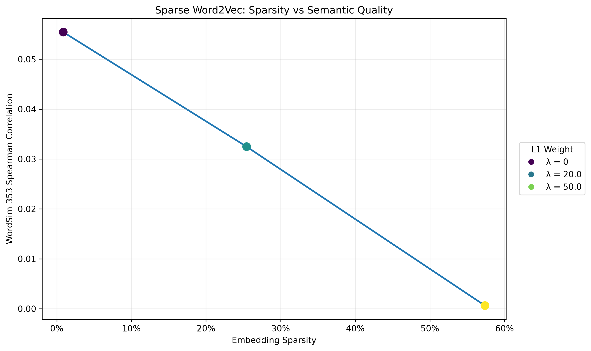

# Word2Vec From Scratch

A from-scratch implementation of **Skip-Gram with Negative Sampling (SGNS)** in PyTorch, extended to investigate the tradeoff between **embedding sparsity and semantic quality**.

## Overview

This project implements the core Word2Vec training pipeline without using pretrained embeddings or a high-level Word2Vec library.

The implementation includes:

- Skip-Gram training pair generation
- Separate center and context embedding matrices
- Negative sampling using the unigram distribution raised to the 0.75 power
- Batched SGNS training
- Collision-safe negative sampling
- L1 regularization for sparse embeddings
- Cosine-similarity nearest-neighbor search
- WordSim-353 semantic evaluation
- Sparsity vs. semantic-quality experiments

## How It Works

Given a center word and a nearby context word, the model learns embeddings that assign a high probability to real center-context pairs and a low probability to randomly sampled negative pairs.

For a center embedding $v_c$ and context embedding $v_o$, the model computes:

$$
P(o|c) = \sigma(v_c \cdot v_o)
$$

Negative samples are drawn from a frequency-based distribution:

$$
P(w) \propto \text{count}(w)^{0.75}
$$

Rather than computing a full softmax across the vocabulary, the model learns from one positive pair and several sampled negative pairs.

## Sparse Embedding Experiment

The base SGNS implementation was extended with **L1 regularization** to investigate whether sparse word representations could be learned while retaining semantic information.

The training objective becomes:

$$
L = L_{\text{positive}} + L_{\text{negative}} + \lambda L_1
$$

where $\lambda$ controls the strength of the sparsity penalty.

Sparsity is measured as the proportion of center-embedding parameters with an absolute value below `0.01`.

## Experimental Setup

The final models were trained using:

| Parameter | Value |
|---|---:|
| Corpus | Text8 |
| Training tokens | 1,000,000 |
| Vocabulary size | 13,966 |
| Embedding dimension | 32 |
| Context window | 2 |
| Negative samples | 3 |
| Batch size | 256 |
| Epochs | 5 |
| Optimizer | SGD |
| Learning rate | 0.1 |
| L1 weights | 0, 20, 50 |

All experimental models used the same random seed and training configuration so that the primary changed variable was L1 regularization strength.

## Results

| L1 Weight | Embedding Sparsity | Prediction Loss | WordSim-353 Spearman |
|---:|---:|---:|---:|
| 0 | 0.86% | 2.258 | 0.0554 |
| 20 | 25.44% | 1.791 | 0.0325 |
| 50 | 57.38% | 1.470 | 0.0006 |



Increasing L1 regularization produced dramatically sparser representations, but semantic agreement with human similarity judgments declined.

At an L1 weight of `20`, approximately one quarter of the embedding parameters were near zero while measurable semantic structure remained.

At an L1 weight of `50`, more than half of the embedding parameters were near zero and WordSim correlation approached zero.

The experiment therefore demonstrates a clear **sparsity-quality tradeoff** under this training configuration.

## An Interesting Result: Lower Loss ≠ Better Embeddings

One particularly useful result appeared when comparing prediction loss with external semantic evaluation.

As L1 regularization increased, prediction loss decreased:

```text
λ = 0    → 2.258
λ = 20   → 1.791
λ = 50   → 1.470
```

But WordSim-353 correlation simultaneously decreased:

```text
λ = 0    → 0.0554
λ = 20   → 0.0325
λ = 50   → 0.0006
```

This illustrates an important machine-learning principle:

> Improving one optimization metric does not necessarily improve the property of the representation that actually matters.

For this experiment, stronger regularization drove more embedding parameters toward zero while prediction loss decreased, but semantic agreement with human judgments also deteriorated.

## Semantic Evaluation

Semantic quality is evaluated using **WordSim-353**, a dataset containing word pairs with human similarity judgments.

For every WordSim pair present in the learned vocabulary:

1. Retrieve both learned center embeddings.
2. Calculate their cosine similarity.
3. Compare model similarities with human similarity scores.
4. Calculate Spearman rank correlation across all valid pairs.

The final vocabulary covered **266 WordSim-353 pairs**.

The dense baseline achieved:

```text
Spearman correlation: 0.0554
```

The absolute correlation is low compared with mature Word2Vec implementations trained on substantially larger corpora.

This project uses a relatively small 1M-token training subset, 32-dimensional embeddings, and five training epochs. The experiment should therefore be interpreted primarily as an investigation of the **relative effect of increasing sparsity**, rather than as an attempt to produce state-of-the-art word embeddings.

## Negative Sampling

Negative examples are sampled according to:

```python
weight = count ** 0.75
```

and sampled using PyTorch's multinomial sampler.

Training uses three negative samples for every positive center-context pair.

The implementation also checks sampled negatives against the true context word. If a sampled negative accidentally equals the positive context, only the invalid sample is resampled.

This prevents the model from receiving contradictory positive and negative supervision for the same training pair.

## Batched Training

Training examples are processed in batches of `256` rather than performing an optimizer update for every individual center-context pair.

Each batch contains:

```text
center IDs:   [batch_size]
context IDs:  [batch_size]
negative IDs: [batch_size, 3]
```

The model performs embedding lookups and dot products for the entire batch using tensor operations.

A final partial batch is also processed so training pairs are not silently discarded when the number of examples is not divisible by the batch size.

## Nearest-Neighbor Search

The project includes a `most_similar()` function for inspecting the learned embedding space.

For a query word, cosine similarity is calculated between its embedding and every other word embedding, and the highest-scoring neighbors are returned.

This provides a qualitative complement to the quantitative WordSim evaluation.

## Project Structure

```text
word2vec/
│
├── model.py
│   ├── Word2Vec model
│   └── cosine-similarity nearest-neighbor search
│
├── tokenizer.py
│   └── vocabulary construction and word indexing
│
├── training_pairs.py
│   └── Skip-Gram center-context pair generation
│
├── data_loader.py
│   └── Text8 loading
│
├── experiments.py
│   ├── batched SGNS training
│   ├── negative sampling
│   ├── L1 regularization experiments
│   └── model checkpoint saving
│
├── evaluate.py
│   └── WordSim-353 Spearman evaluation
│
├── plots.py
│   └── sparsity vs. semantic-quality visualization
│
├── sparsity_vs_semantic_quality.png
│
└── data/
    └── wordsim353/
```

## What I Learned

Building Word2Vec from scratch exposed implementation details that are normally hidden behind high-level ML libraries.

Some of the most important lessons were:

- How Skip-Gram converts a text corpus into center-context training examples
- How center and context embedding matrices are independently learned
- How dot products become probabilities through the sigmoid function
- How negative sampling replaces an expensive full-vocabulary objective
- Why Word2Vec uses the unigram distribution raised to the `0.75` power
- How tensor shapes change when moving from individual examples to batched training
- How vectorization reduces Python-level training overhead
- Why negative samples must be checked against positive contexts
- How L1 regularization drives model parameters toward zero
- How to quantify embedding sparsity
- How cosine similarity can be used to inspect learned representation geometry
- How WordSim-353 provides an external measure of semantic quality
- Why lower prediction loss does not necessarily mean better learned representations

## Tech Stack

- Python
- PyTorch
- Pandas
- SciPy
- Matplotlib

## Limitations

This implementation is intentionally educational and experimental rather than optimized to compete with production Word2Vec libraries.

Notable limitations include:

- Training uses only 1M tokens from Text8.
- Embeddings are only 32-dimensional.
- Training runs for five epochs.
- Only three negative samples are used per positive pair.
- Hyperparameter tuning is limited.
- WordSim coverage is restricted by the learned vocabulary.
- The implementation prioritizes transparency over maximum training throughput.

These constraints make the model small enough to inspect and modify directly while still allowing experiments on the behavior of learned embeddings.

## Future Work

Potential extensions include:

- Training on the complete Text8 corpus
- Larger embedding dimensions
- Learning-rate scheduling
- More negative samples
- Subsampling extremely frequent words
- Dynamic context windows
- GPU training
- Vectorized data loading
- Additional semantic benchmarks
- Comparison against established Word2Vec implementations
- Alternative sparsity-inducing techniques

## Purpose

The goal of this project was not simply to call an existing Word2Vec implementation.

It was to build the training system from its underlying components, understand how those components interact, and then use that implementation to investigate the relationship between **representation sparsity and semantic quality**.